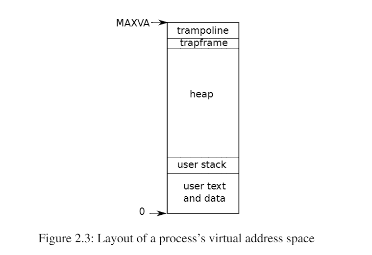

# 2.5 进程概述

Xv6（和其他Unix操作系统一样）中的隔离单位是一个进程。进程抽象防止一个进程破坏或监视另一个进程的内存、CPU、文件描述符等。它还防止一个进程破坏内核本身，这样一个进程就不能破坏内核的隔离机制。内核必须小心地实现进程抽象，因为一个有缺陷或恶意的应用程序可能会欺骗内核或硬件做坏事（例如，绕过隔离）。内核用来实现进程的机制包括用户/管理模式标志、地址空间和线程的时间切片。

为了帮助加强隔离，进程抽象给程序提供了一种错觉，即它有自己的专用机器。进程为程序提供了一个看起来像是私有内存系统或地址空间的东西，其他进程不能读取或写入。进程还为程序提供了看起来像是自己的CPU来执行程序的指令。

Xv6使用页表（由硬件实现）为每个进程提供自己的地址空间。RISC-V页表将虚拟地址（RISC-V指令操纵的地址）转换（或“映射”）为物理地址（CPU芯片发送到主存储器的地址）。

Xv6为每个进程维护一个单独的页表，定义了该进程的地址空间。如图2.3所示，以虚拟内存地址0开始的进程的用户内存地址空间。首先是指令，然后是全局变量，然后是栈区，最后是一个堆区域（用于`malloc`）以供进程根据需要进行扩展。有许多因素限制了进程地址空间的最大范围： RISC-V上的指针有64位宽；硬件在页表中查找虚拟地址时只使用低39位；xv6只使用这39位中的38位。因此，最大地址是2^38-1=0x3fffffffff，即`MAXVA`（定义在***kernel/riscv.h***:348）。在地址空间的顶部，xv6为`trampoline`（用于在用户和内核之间切换）和映射进程切换到内核的`trapframe`分别保留了一个页面，正如我们将在第4章中解释的那样。

xv6内核为每个进程维护许多状态片段，并将它们聚集到一个`proc`(***kernel/proc.h***:86)结构体中。一个进程最重要的内核状态片段是它的页表、内核栈区和运行状态。我们将使用符号`p->xxx`来引用`proc`结构体的元素；例如，`p->pagetable`是一个指向该进程页表的指针。

每个进程都有一个执行线程（或简称线程）来执行进程的指令。一个线程可以挂起并且稍后再恢复。为了透明地在进程之间切换，内核挂起当前运行的线程，并恢复另一个进程的线程。线程的大部分状态（本地变量、函数调用返回地址）存储在线程的栈区上。每个进程有两个栈区：一个用户栈区和一个内核栈区（`p->kstack`）。当进程执行用户指令时，只有它的用户栈在使用，它的内核栈是空的。当进程进入内核（由于系统调用或中断）时，内核代码在进程的内核堆栈上执行；当一个进程在内核中时，它的用户堆栈仍然包含保存的数据，只是不处于活动状态。进程的线程在主动使用它的用户栈和内核栈之间交替。内核栈是独立的（并且不受用户代码的保护），因此即使一个进程破坏了它的用户栈，内核依然可以正常运行。

一个进程可以通过执行RISC-V的`ecall`指令进行系统调用，该指令提升硬件特权级别，并将程序计数器（PC）更改为内核定义的入口点，入口点的代码切换到内核栈，执行实现系统调用的内核指令，当系统调用完成时，内核切换回用户栈，并通过调用`sret`指令返回用户空间，该指令降低了硬件特权级别，并在系统调用指令刚结束时恢复执行用户指令。进程的线程可以在内核中“阻塞”等待I/O，并在I/O完成后恢复到中断的位置。

`p->state`表明进程是已分配、就绪态、运行态、等待I/O中（阻塞态）还是退出。

`p->pagetable`以RISC-V硬件所期望的格式保存进程的页表。当在用户空间执行进程时，Xv6让分页硬件使用进程的`p->pagetable`。一个进程的页表也可以作为已分配给该进程用于存储进程内存的物理页面地址的记录。